# 4. PROJETO DO DESIGN DE INTERAÇÃO

## 4.1 Personas
Nesta seção você deve detalhar as personas do seu projeto. Deve-se documentar uma persona por integrante do projeto. Para mais informações sobre personas consulte: https://www.rdstation.com/blog/marketing/persona-o-que-e/. Sugere-se a utilização de um template do Canva: https://www.canva.com/pt_br/modelos/s/persona/

Persona 1: Lucas Silva
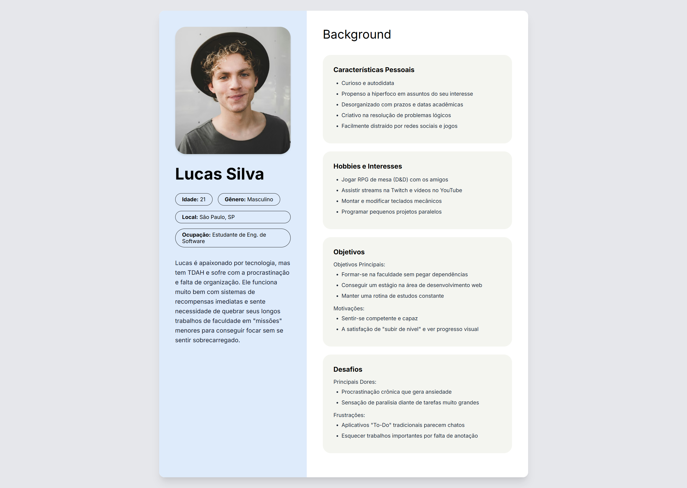

Persona 2: Marina Albuquerque
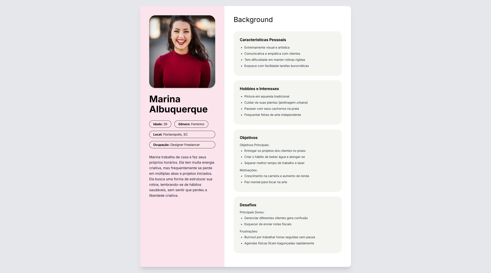

Persona 3: Roberto Mendes
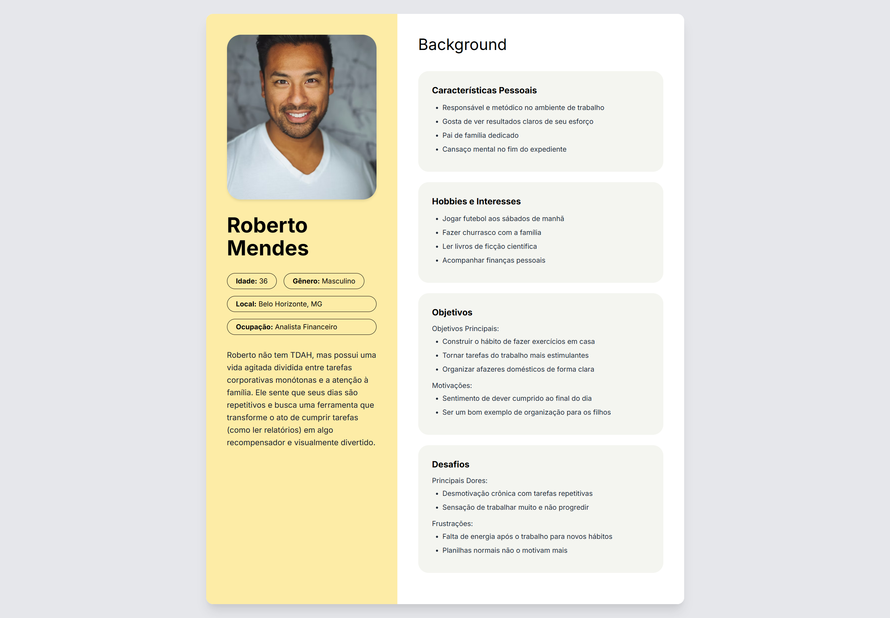

## 4.2 Mapa de Empatia
Mapa da Empatia é um material utilizado para conhecer melhor o seu cliente. A partir do mapa da empatia é possível detalhar a personalidade do cliente e compreendê-la melhor. O objetivo é obter um nível mais profundo de compreensão de uma persona. A seguir um exemplo de template que pode ser usado para o mapa de empatia. Para cada persona deverá ser apresentado o seu respectivo mapa de empatia. Sugere-se a utilização do template apresentado em https://www.rdstation.com/blog/marketing/mapa-da-empatia/.

Mapa de Empatia: Lucas Silva
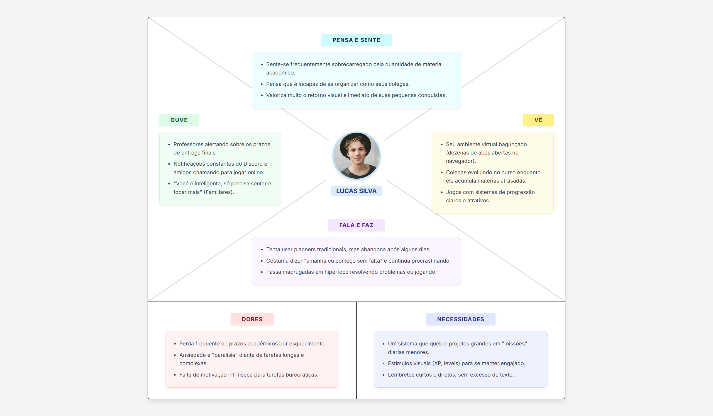

Mapa de Empatia: Marina Albuquerque
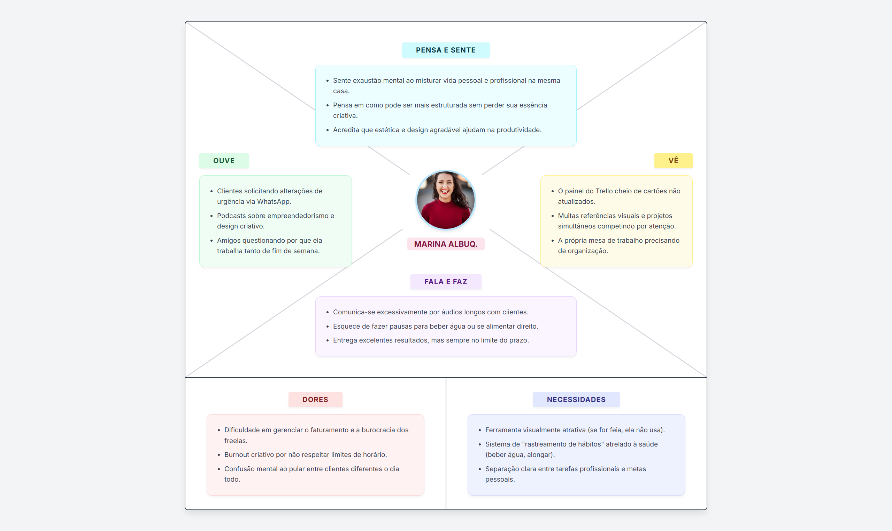

Mapa de Empatia: Roberto Mendes
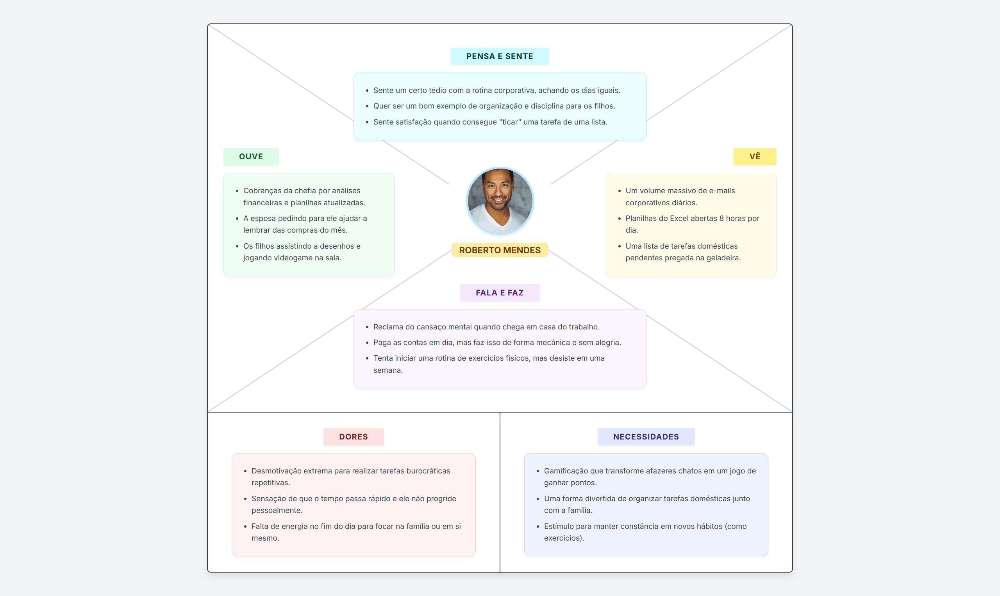

## 4.3 Protótipos das Interfaces
Apresente nesta seção os protótipos de alta fidelidade do sistema proposto. A fidelidade do protótipo refere-se ao nível de detalhes e funcionalidades incorporadas a ele. Assim, um protótipo de alta fidelidade é uma representação interativa do produto, baseada no computador ou em dispositivos móveis. Esse protótipo já apresenta maior semelhança com o design final em termos de detalhes e funcionalidades. No desenvolvimento dos protótipos, devem ser considerados os princípios gestálticos, as recomendações ergonômicas e as regras de design (como as 8 regras de ouro). É importante descrever no texto do relatório como os princípios gestálticos e as regras de ouro foram seguidas no projeto das interfaces. Nesta etapa deve-se dar uma ênfase na implementação do software de modo que possam ser realizados os testes com usuários na etapa seguinte.

4.3.1 Tela de Login: Tela inicial onde o usuário realiza a autenticação na plataforma para acessar seu painel gamificado, possuindo também atalho direto para a criação de uma nova conta.
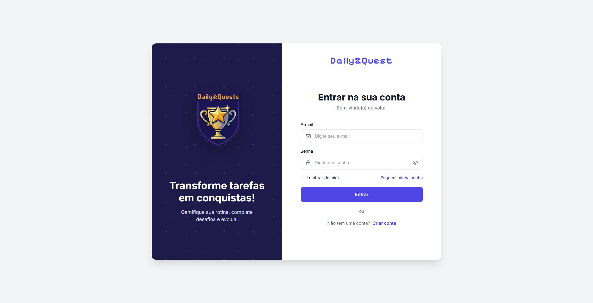

4.3.2 Tela de Cadastro: Tela onde o novo usuário preenche seus dados pessoais essenciais para registrar uma conta e iniciar sua jornada de produtividade.
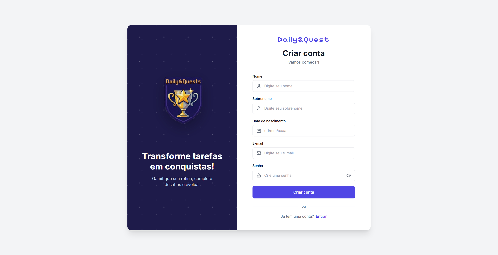

4.3.3 Interface principal do sistema organizada em colunas para a gestão de hábitos e tarefas. O diferencial é o sistema de RPG, onde o usuário ganha pontos de experiência (XP) ou recupera vida (HP) ao concluir suas obrigações diárias, transformando a produtividade em um jogo.
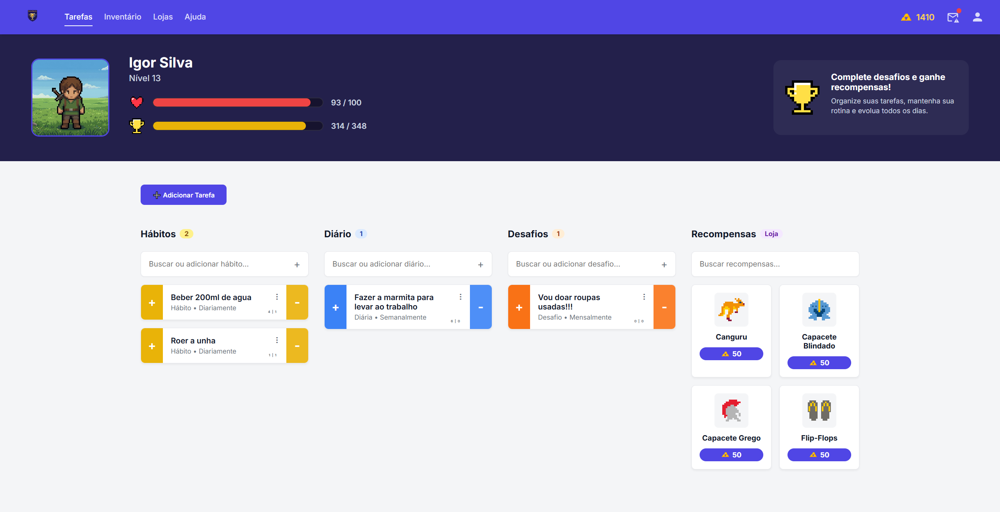

4.3.4 Tela de Inventário: Tela onde são listados os itens e recompensas virtuais adquiridos pelo usuário na loja da plataforma, com opção de filtros laterais por categorias específicas (pets, equipamentos, etc.).
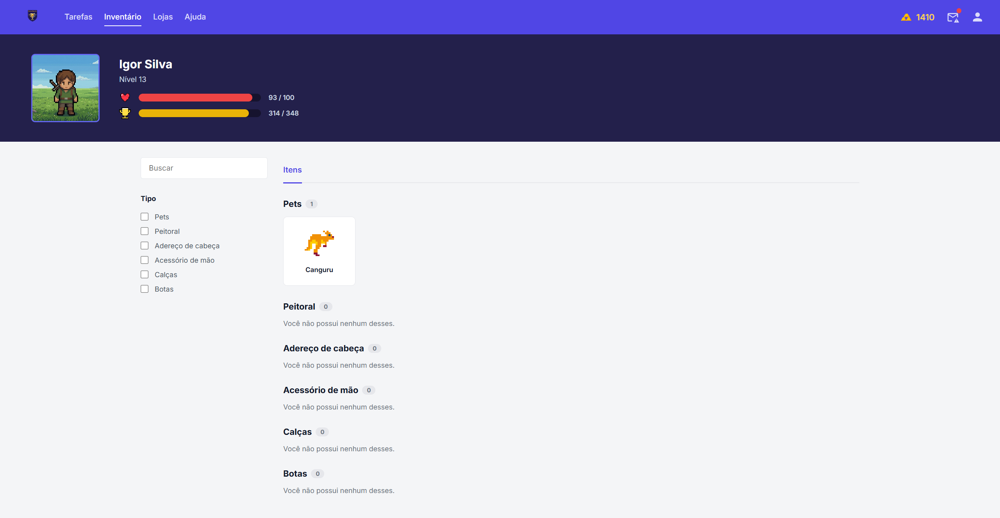

4.3.5 Tela Perfil: Tela funcionando como painel de controle flutuante, onde o usuário edita seus dados de cadastro, ajusta o nome de exibição do seu avatar e acompanha suas estatísticas básicas.
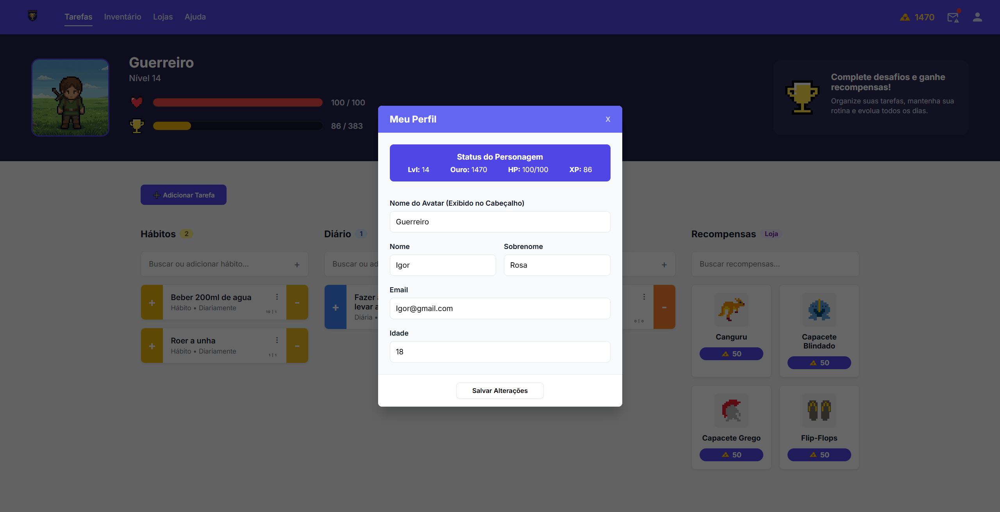

## 4.4 Testes com Protótipos
Nesta seção você deve apresentar os testes realizados com usuários utilizando os protótipos de alta fidelidade desenvolvidos na seção anterior. O objetivo é avaliar a usabilidade, a clareza das informações e a adequação do design às necessidades das personas definidas no projeto.

Cada integrante do grupo deverá aplicar o teste com um usuário distinto, preferencialmente alinhado ao perfil das personas criadas. Devem ser definidas previamente as tarefas que o usuário deverá executar no protótipo (por exemplo: realizar um cadastro, buscar um produto, concluir uma compra).

Durante a aplicação do teste, registre observações sobre comportamentos, dúvidas, erros e comentários feitos pelo usuário, bem como o tempo necessário para a execução de cada tarefa. Ao final, colete o feedback do participante, destacando pontos positivos e aspectos a serem melhorados.

Os resultados obtidos por todos os integrantes devem ser consolidados, apresentando uma análise geral com os principais problemas encontrados, oportunidades de melhoria e as ações previstas para o projeto final. 
